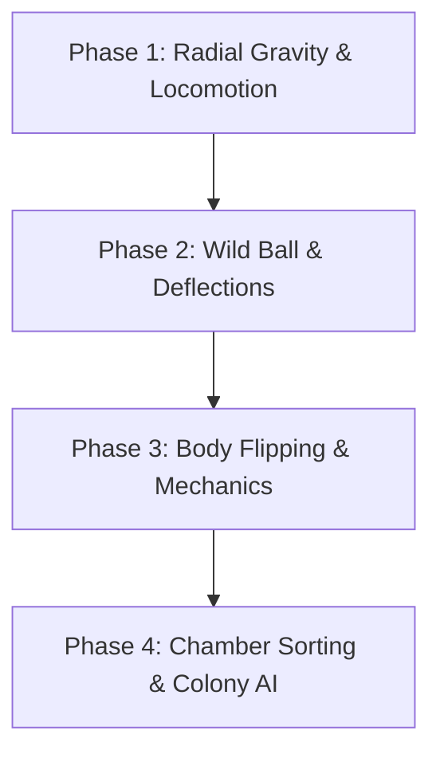

# FLUX: A Cyberspace Pinball Survival World
*Core Design Document - Version 1.0*

---

## 1. Core Premise & Concept
**FLUX** is an action-survival game set inside a living cyberspace topology where the primary physical paradigm, threat, and resource is pinball.

- **The World is the Machine:** Space is structured as a network of cylindrical tunnels (**Tubes**) and processing nodes (**Chambers**). 
- **Traversal is Play:** Unlike traditional video pinball where travel is downtime, moving *between* chambers under realistic pinball physics is the core gameplay.
- **Ecological Judo:** Players do not steer directly; they manipulate world geometry, timing, and momentum to redirect forces, evade hazards, and harvest data packets.

---

## 2. The Two-Tier Civilization

The inhabitants of the tubes have evolved around the management of the data stream. Their anatomy dictates their agency:

### Flippers (The Ones)
- **Anatomy:** Unilateral mechanical-lever organisms. They possess a single flipper-like appendage.
- **Agency:** Binary behavior (flip or don't flip).
- **Behavior:** They survive by grouping into colonies at natural tube bends and chokepoints, creating cooperative defensive arrays to deflect wild packets. They form the background labor and safety infrastructure of the machine.

### Ballers (The Twos)
- **Anatomy:** Bilaterally symmetrical organisms with a pair of flippers (mimicking the classic drain flipper layout of a pinball machine).
- **Agency:** Bilateral control. They can perform complex actions: catch, cradle, hold, aim, and command.
- **Role:** The engineers and explorers. Ballers utilize their bilateral agency to harness packets as resources, establish sorting industries (Chambers), and forge shortcut warp-tubes.

---

## 3. Spatial & Physics Architecture

### Cylindrical Gravity (Tubes)
- Gravity acts **radially outward** from the tube's center line.
- Inhabitants experience the interior wall as a flat, walkable floor. Walking perpendicular to the tube's length creates a circular loop. Walking along it moves the player forward.
- The scale is human-centric: players cannot easily jump across the diameter, but a timed vertical jump places them directly in the path of traversing packets.

### Ball Relationship States
Rather than rigid ownership, balls (packets) interact with inhabitants in dynamic states:
- **Wild:** Ambient threat or drifting particle. Follows raw physics; hazardous to touch.
- **Contested:** Multiple Flippers/Ballers actively altering its trajectory.
- **Claimed:** A Baller has established a controlled bounce cycle, utilizing the packet for momentum or shielding.
- **Harvested:** Routed successfully into a Chamber for processing.

---

## 4. Data Packet Taxonomy (Balls)

Balls are the economy and ecology of the world:

| Packet Type | Description | Physics Behavior | Economic Value |
| :--- | :--- | :--- | :--- |
| **Drift** | Ambient background noise | Low mass, slow drift | Minor power cell |
| **Burst** | High-priority signal | Low warning, high velocity | Acceleration fuel |
| **Broadcast** | Large public transmission | Massive, highly destructive | Bulk raw material |
| **Recursive** | Loop error packet | Orbits local geometry | Defensive trap generator |
| **Seeker** | Targeted packet | Trajectory tracks local nodes | Warp-tube key / Fast travel fuel |
| **Fragments** | Corrupted data | Splits into multi-balls on impact | Highly hazardous, yields raw code dust |

---

## 5. Locomotion & Action-Flipping Verbs

- **Locomotion:** 2.5D platformer movement along the tube walls (running, climbing, mantling, sliding).
- **Squat-to-Stand Body Flip:** Players crouch to compress their volume, then leap upwards with arms extended to act as a physical flipper, launching colliding balls down the tube axis.
- **Multiball Surfing:** Accomplished by keeping multiple Seeker/Burst packets ahead of the player, matching their speed, and continuously flipping them forward to build a supersonic slipstream.

---

## 6. Rendering & Visual Language

- **Cyberspace Grid:** Sleek, dark backgrounds with glowing neon outlines where color denotes function (Cyan = path, Red = threat, Gold = value/boost).
- **The Data River:** A volumetric light beam running down the exact center axis of the tube, acting as the main light source, spawning point for wild packets, and depth-fog replacement.
- **Glitch Styles:** 
  - *80s CRT/Scanlines:* Indicates ancient, abandoned infrastructure.
  - *90s VHS/Color Bleed:* Indicates common, heavily-traveled public corridors.
  - *Contemporary Glitch:* High-load, unstable, or actively contested zones.

---

## 7. Prototype Roadmap

1. **Phase 1:** Set up a cylindrical scene in Godot. Implement custom radial gravity pulling toward the inner tube wall. Get the player character walking, jumping, and looping around the cylinder.
2. **Phase 2:** Spawn a physical ball (packet) rolling down the tube axis. Implement passive bounce reactions on the player and obstacles.
3. **Phase 3:** Implement the player's crouch-to-flip action to redirect the ball.
4. **Phase 4:** Build a basic chamber transition and sorting triggers.
